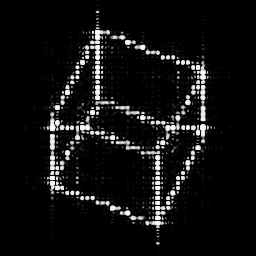

# Improving image quality of Phase Added Stereogram(PAS) using deep learning
## 1.使用したモデル
### U-Netモデルを作成しました。過学習を防ぐために，層が深いところにはDropout層を入れました。モデルのコードは，リポジトリ内の「unet2.py」にあります。

## 2.データセットの概要
#### 入力にはPASホログラムの複素振幅情報として実部と虚部の生データ，教師データには，フレネルCGH(3次元物体の情報が正確に記録されているホログラム)の複素振幅情報として実部と虚部の生データを用いました。物体点数300の点群データのホログラムを扱いました。

## 3.学習曲線
#### 学習率lr=0.0005の時　

#### 学習率lr=0.00005の時

## 4.テストおよび実験結果
#### テストデータとして立方体の点群データ(物体点数284)を用いました．
#### 正解画像であるフレネルCGHの再生像が以下のようになります。

#### 入力であるPASホログラムの再生像が以下のようになります。

#### モデルを通して得られた推論ホログラムの再生像は以下のようになります。

#### 画質評価指標として*PSNR*を用いました。フレネルCGHに対するPASの再生像のPSNRは，40.9dBですが，推論ホログラムは*48.5*dBとなり，PSNRが向上しています。また，視覚的にも推論ホログラムの再生像ではノイズが抑えられ，画質が改善されていることがわかります。詳細な結果はリポジトリ内の「PSNRcomparison.xlsx」にあります。
